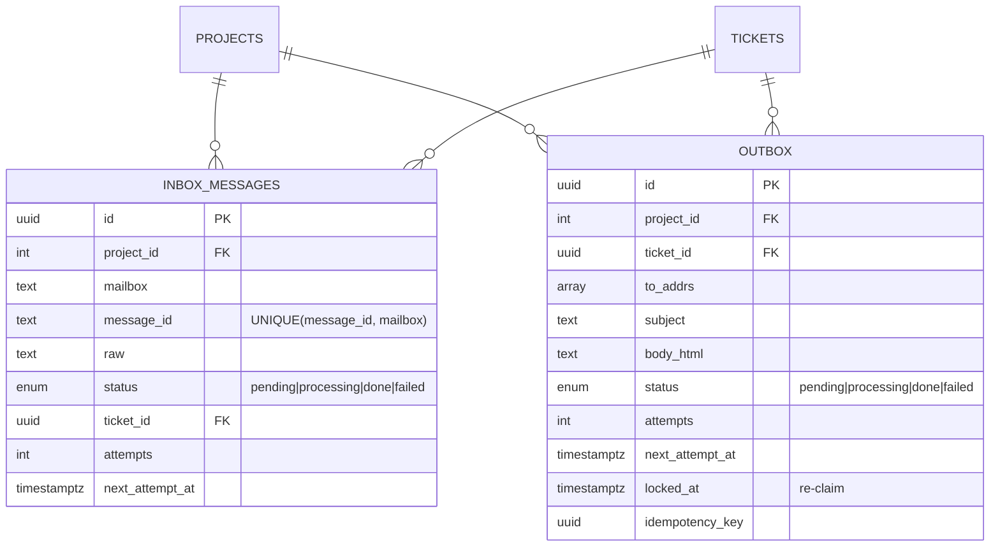

# ERD — HRIS / C&B Ticket Database

> Sơ đồ quan hệ thực thể, dựng từ schema live (PostgreSQL 18.4, 49 bảng). Xem tổng quan nghiệp vụ
> ở `docs/PROJECT-OVERVIEW.md`. Render Mermaid: VS Code (Markdown Preview Mermaid) hoặc
> [mermaid.live](https://mermaid.live).

## 1. Sơ đồ lõi (Core — vòng đời ticket)

```mermaid
erDiagram
    PROJECTS ||--o{ USERS : "có"
    PROJECTS ||--o{ CATEGORIES : "có nhóm"
    PROJECTS ||--o{ TICKETS : "chứa"
    PROJECTS ||--o{ TAGS : "định nghĩa"

    USERS ||--o{ USER_GROUP_MEMBERSHIP : "thuộc"
    CATEGORIES ||--o{ USER_GROUP_MEMBERSHIP : "gồm"

    CATEGORIES ||--o{ TICKETS : "phân loại"
    USERS ||--o{ TICKETS : "phụ trách (assignee)"

    TICKETS ||--o{ TICKET_MESSAGES : "hội thoại"
    TICKETS ||--o{ PARTICIPANTS : "người tham gia"
    TICKETS ||--o{ ATTACHMENTS : "tệp"
    TICKET_MESSAGES ||--o{ ATTACHMENTS : "đính kèm"

    TICKETS ||--o{ TICKET_TAGS : ""
    TAGS ||--o{ TICKET_TAGS : ""

    TICKETS ||--o{ TICKET_LINK : "ticket_a"
    TICKETS ||--o{ TICKET_LINK : "ticket_b (cross-post)"

    TICKETS ||--o{ INBOX_MESSAGES : "nguồn mail vào"
    TICKETS ||--o{ OUTBOX : "mail gửi ra"
    USERS ||--o{ NOTIFICATIONS : "nhận (actor)"

    PROJECTS {
        bigint   id PK
        enum     key "hris | cnb"
        text     name
    }
    USERS {
        uuid     id PK
        int      project_id FK
        text     email UK
        enum     role "member|team_lead|admin|ssa"
        bool     disabled "chặn ở tầng session"
        bool     must_change_password
        date     away_from
        date     away_to
    }
    CATEGORIES {
        bigint   id PK
        int      project_id FK
        text     name_vi
        text     name_en
        bool     is_sensitive "→ badge 🛡, view_log"
        bool     is_system "nhóm 'Khác'"
        bool     disabled
    }
    USER_GROUP_MEMBERSHIP {
        uuid     user_id FK
        int      category_id FK
    }
    TICKETS {
        uuid     id PK
        int      project_id FK
        text     ticket_code "#NNNNN"
        text     subject
        text     requester_email
        text     mailbox
        int      category_id FK
        enum     status "open→…→closed"
        uuid     assignee_id FK "NULL = Pool"
        int      reopen_count
        bool     reopen_locked
        bool     is_junk
        bool     is_spam_thread
        int      junked_from_category_id FK
        date     snooze_until
        timestamptz last_opened_at
        timestamptz first_read_at "NULL = chưa ai mở"
        timestamptz assigned_at
        timestamptz closed_at
        tsvector search_tsv "FTS không dấu"
    }
    TICKET_MESSAGES {
        uuid     id PK
        uuid     ticket_id FK
        enum     direction "inbound|outbound"
        bool     is_internal "ghi chú nội bộ"
        text     from_addr
        array    to_addrs
        text     body_text
        text     body_html_safe "đã sanitize"
        text     message_id "dedup"
        text     in_reply_to
        bool     is_auto_reply
    }
    PARTICIPANTS {
        bigint   id PK
        uuid     ticket_id FK
        text     email
        enum     status "active|pending_approval|rejected"
    }
    ATTACHMENTS {
        uuid     id PK
        uuid     ticket_id FK
        uuid     message_id FK
        text     file_name
        text     mime_type
        int      size
        text     storage_path "UUID path"
        enum     status "pending|stored"
        text     content_id "cid: inline"
    }
    TAGS {
        bigint   id PK
        int      project_id FK
        text     name
        enum     kind "manual|auto|priority"
        text     color
    }
    TICKET_TAGS {
        uuid     ticket_id FK
        int      tag_id FK
    }
    TICKET_LINK {
        uuid     ticket_a FK
        uuid     ticket_b FK
        text     kind "cross_post"
    }
```

## 2. Sơ đồ Email engine (ingest / outbox)

## 3. Toàn bộ 49 bảng theo domain

### Định danh & phân quyền
| Bảng | Vai trò |
|------|---------|
| `projects` | 2 project: `hris`, `cnb` (gốc mọi thứ) |
| `users` | ~40 người; role 4 cấp; `disabled` chặn ở session |
| `categories` | "Nhóm" nghiệp vụ (Payroll, Insurance…); `is_sensitive`, `is_system` |
| `user_group_membership` | Ai thuộc nhóm nào (member ↔ category) — **M:N** |
| `role_capabilities` | Ma trận quyền theo role (feed `/me`, UX menu; SSA sửa runtime) |
| `sessions` | Phiên đăng nhập (cookie) |
| `otp_codes` | OTP 2FA (gửi thẳng SMTP) |
| `password_reset_tokens` | Token reset mật khẩu |
| `login_attempts` | Chống brute-force (khóa theo IP) |

### Ticket lõi
| Bảng | Vai trò |
|------|---------|
| `tickets` | Thực thể trung tâm — trạng thái, assignee, junk, overdue, FTS |
| `ticket_messages` | Hội thoại (inbound/outbound + ghi chú nội bộ) |
| `participants` | Người tham gia thread (duyệt người lạ) |
| `attachments` | Tệp đính kèm (signed URL, repair) |
| `tags` + `ticket_tags` | Nhãn (manual/auto/priority) gắn vào ticket — **M:N** |
| `tag_keywords` | Keyword auto-gắn nhãn |
| `ticket_link` | Liên kết cross-post giữa 2 ticket |

### Phân loại & định tuyến
| Bảng | Vai trò |
|------|---------|
| `category_keywords` | Keyword → nhóm (classify không dấu) |
| `auto_assign_config` + `auto_assign_members` | Cấu hình round-robin / least-load per nhóm |
| `assign_cursors` | Con trỏ round-robin (khóa `FOR UPDATE` chống double-assign) |

### Email engine
| Bảng | Vai trò |
|------|---------|
| `inbox_messages` | Mail vào — dedup `(message_id, mailbox)`, effectively-once |
| `outbox` | Mail ra — at-least-once, backoff, idempotency |
| `imap_cursor` | Con trỏ IMAP mỗi mailbox (commit sau persist) |
| `email_connections` | Cấu hình IMAP/SMTP per project (**DB thắng env**, App Password mã hoá) |
| `email_templates` / `reply_templates` | Mẫu email hệ thống / mẫu trả lời nhanh |
| `idempotency_keys` | Chống trùng thao tác |

### Chống rác / lạm dụng
| Bảng | Vai trò |
|------|---------|
| `blocklist` | Người gửi bị chặn |
| `allowlist` | Người gửi tin cậy |
| `junk_rules` | Luật đánh dấu rác |
| `mail_bomb_counters` + `mail_bomb_alert_log` | Đếm & cảnh báo mail-bomb |

### Vòng đời / nhắc việc / scheduler
| Bảng | Vai trò |
|------|---------|
| `reminder_config` | Ngưỡng overdue, giờ digest per project |
| `project_settings` | Cấu hình khác per project |
| `project_counters` | Sinh `ticket_code` tuần tự |
| `digest_log` | Dedup + gửi bù digest (theo `recipient, date_vn`) |
| `overdue_escalation_log` | Nhắc quá hạn (dedup) |
| `snooze_reminder_log` | Nhắc snooze tới hạn |
| `reopen_notice_log` | Dedup thông báo reopen ticket khóa (24h) |

### Thông báo / audit / giám sát
| Bảng | Vai trò |
|------|---------|
| `notifications` | Thông báo in-app (chuông) |
| `audit_log_2026 … _2031`, `_default` | **Audit append-only**, phân mảnh theo năm (REVOKE UPDATE/DELETE) |
| `view_log` | Log đọc ticket/tệp **nhạy cảm** (FR67) |
| `worker_heartbeats` | Nhịp sống của worker (chết → cảnh báo) |
| `drafts` | Nháp reply/note tự lưu (per user + ticket) |

## 4. Enum tham chiếu
| Enum | Giá trị |
|------|---------|
| `projects.key` | `hris`, `cnb` |
| `users.role` | `member`, `team_lead`, `admin`, `ssa` |
| `tickets.status` | `open` → `assigned` → `in_progress` → `pending` → `resolved` → `closed` |
| `ticket_messages.direction` | `inbound`, `outbound` |
| `participants.status` | `active`, `pending_approval`, `rejected` |
| `attachments.status` | `pending`, `stored` |
| `tags.kind` | `manual`, `auto`, `priority` |
| `inbox_messages.status` / `outbox.status` | `pending`, `processing`, `done`, `failed` |

## 5. Ghi chú quan hệ quan trọng
- **`tickets.assignee_id` NULL = ở Pool** (chưa ai nhận). Đây là điều kiện atomic của `claim`.
- **`tickets` có 2 FK tới `categories`**: `category_id` (nhóm hiện tại) và `junked_from_category_id`
  (nhớ nhóm gốc khi đánh dấu rác — để không rò ticket lương sang nhóm khác).
- **`attachments` có 2 FK**: `ticket_id` (bắt buộc) và `message_id` (tệp thuộc message nào).
- **`ticket_link` tự tham chiếu `tickets` 2 lần** (ticket_a ↔ ticket_b) cho cross-post giữa 2 project.
- **RLS bật thật** trên `tickets`, `drafts`, `notifications`; các bảng khác dựa vào role-gate ở
  controller + join tầng app. `tickets` bật `FORCE RLS` (kể cả owner cũng bị áp).
- **Chỉ `tickets` và `ticket_messages` có `search_tsv`** (FTS tiếng Việt không dấu qua `f_unaccent`).
</content>
