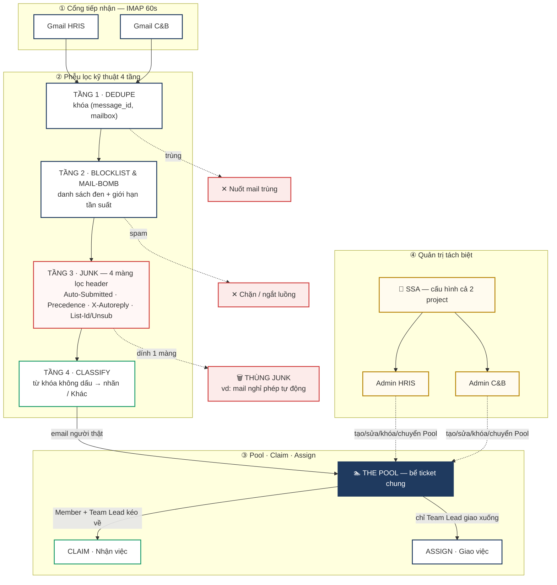

# Workflow Map — Ghi chú Slide (copy-paste)

> Ảnh: `docs/workflow-map.svg` (vector — chèn thẳng PowerPoint/Google Slides) và
> `docs/workflow-map.png` (3840×2160, cho tool không import SVG).

---

## 📭 Phân khu 1 — Cổng tiếp nhận (Inbound Source)
Hệ thống tiếp nhận **song song** luồng email thô từ **2 hộp thư Gmail độc lập**: `hris` và `cnb`.
Dữ liệu được đẩy liên tục theo **chu kỳ quét IMAP mỗi 60 giây (NFR3)**.

## 🌪️ Phân khu 2 — Phễu lọc kỹ thuật 4 tầng (Core Ingest Pipeline)
Luồng email **bắt buộc** đi qua trục dọc 4 tầng kiểm tra trước khi được phép thành ticket:

- **Tầng 1 — DEDUPE (chống gửi trùng):** kiểm khóa composite `(message_id, mailbox)`. Trùng (lỗi
  mạng / bấm gửi 2 lần) → mail thứ 2 **bị nuốt ngay tại cửa ngõ**, tránh ticket rác.
- **Tầng 2 — BLOCKLIST & MAIL-BOMB:** kiểm danh sách đen + giới hạn tần suất gửi trong project.
  Spam dồn dập (mail-bomb) → **tự ngắt luồng**.
- **Tầng 3 — JUNK (phễu con bóc tách thư máy, 4 màng lọc header):**
  1. **Auto-Submitted** (RFC 3834)
  2. **Precedence** (bulk / auto / list)
  3. **X-Autoreply** (header tự chế)
  4. **List-Id / List-Unsubscribe** (dấu hiệu marketing)
  🔴 Dính **bất kỳ 1** màng → bẻ hướng, **rơi thẳng xuống Thùng JUNK** (vd: mail báo nghỉ phép tự
  động). Giữ bể ticket luôn sạch.
- **Tầng 4 — CLASSIFY (phân loại tự động):** quét so khớp **từ khóa không dấu** → gắn nhãn phân mục
  (Payroll · Insurance · Leave…). Không khớp → nhóm **"Khác"**.

## 🏊 Phân khu 3 — Bể Ticket chung & quyền xử lý (Pool · Claim · Assign)
Sau 4 tầng lọc, email **"người thật gõ tay"** an toàn rơi xuống **THE POOL**. Vận hành theo 2 trục:
- **CLAIM (nhận việc):** **Member + Team Lead** trong nhóm chủ động vào Pool kéo ticket về danh sách
  cá nhân.
- **ASSIGN (giao việc):** **chỉ Team Lead** điều phối, giao thẳng ticket từ Pool xuống Member dưới
  quyền.

## 👑 Phân khu 4 — Trục quản trị tách biệt (SSA vs Admin)
Tách hoàn toàn khỏi luồng xử lý để an toàn thông tin C&B:
- **SSA (Super System Admin):** cấp cao nhất, quyền **xuyên suốt** — cấu hình đồng thời **cả 2
  project** (HRIS & C&B).
- **Admin dự án:** **phân mảnh độc lập** theo từng project. Admin HRIS ⟂ Admin C&B (không đụng cấu
  hình của nhau). Admin **chỉ**: tạo · sửa · khóa · chuyển Pool — **KHÔNG trả lời mail chuyên môn**,
  chỉ điều phối vòng đời + cấu hình toàn bộ tham số project của mình.

> ⏱ **Scheduler tick mỗi 60 giây:** digest · nhắc quá hạn · snooze tới hạn · repair đính kèm ·
> worker heartbeat.

---

## Bản Mermaid (chỉnh chữ nhanh — render ở mermaid.live)

</content>
